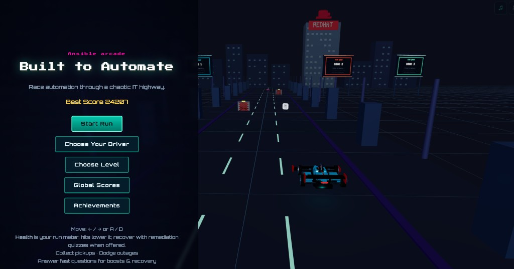

# Built to Automate

A retro-arcade racing game built with Three.js, themed around Ansible and IT automation. Dodge outages, collect playbooks and collections, answer skill-check quizzes, and race your way up the leaderboard.

**[Play it live on GitHub Pages](https://ansible-tmm.github.io/ansible-f1/)**



## Gameplay

- **Move:** Arrow keys (← / →) or A / D
- **Boost:** Arrow Up or W (manual boost when available)
- **Brake:** Arrow Down or S
- **Pause:** Escape or Space
- **Horn:** Mouse click (some vehicles have special abilities instead)
- **Dodge** Outage obstacles that drain your health
- **Collect** Ansible Playbooks (+100 pts), Collections (+150 pts), Policy Shields, and Boost Tokens
- **Answer** Ansible skill-check quizzes to recover health or earn speed boosts
- **Achieve** Automation Flow by getting 3 correct answers in a row (1.2× score + pickup magnet)

Health starts at 100. Four unshielded hits ends the run. Race to the finish line, coast to a stop, and enter your score on the global leaderboard.

## Drivers

| Driver | Origin | Default Car |
|--------|--------|-------------|
| Anshul Behl | Toronto, Canada | Red & Silver F1 |
| Andrius Benokraitis | Durham, NC | Maroon & Orange F1 (VT) |
| Justin Braun | Cary, NC | Black & Gold F1 |
| Remy Duplantis | Raleigh, NC | Turquoise F1 |
| Leo Gallego | Raleigh, NC | Purple F1 |
| Michele Kelley | Durham, NC | Pink & Gold F1 |
| Roger Lopez | Austin, TX | DeLorean |
| Nuno Martins | Johannesburg, ZA | Pickup Truck |
| Hicham Mourad | Casablanca, Morocco | Light Cycle |
| Matthew Packer | Greensboro, NC | Blue & White F1 (Leafs) |
| Aubrey Trotter | Durham, NC | Pink F1 |
| Alex Walczyk | Raleigh, NC | Yellow F1 |

## Secret Modes

Some drivers have hidden alternate vehicles that transform the gameplay. Type the secret word during a race while playing as the correct driver to unlock them. A poof of smoke appears as the car transforms. Secret modes reset when you return to the main menu — each player has to unlock them on their own.

| Driver | Secret Word | Unlocks | Effect |
|--------|-------------|---------|--------|
| Nuno Martins | `hippo` | 🦛 Hippo Mode | Indestructible hippo with a rider. Crushes everything for +50,000 pts each. Ridiculous smash messages. Scores don't count on the leaderboard. Horn plays hippo sound. Victory dance at the end. |
| Andrius Benokraitis | `chunky` | 🚛 Chunky Mode | 18-wheeler semi truck. Indestructible. Plows through everything. Scores don't count on the leaderboard. Custom horn sound. |
| Matthew Packer | `matt` | 🛹 Skate Mode | Skateboard rider with backwards cap and flannel. Click to jump — while airborne you're invincible and pass through obstacles. |
| Leo Gallego | `scaloneta` | 🇦🇷 La Scaloneta | Argentina flag-themed Mercedes-Benz LO 1114 bus. Indestructible. Crushes everything for +50,000 pts with Argentine catchphrases. Entire UI flips to Spanish. Custom sound effect. Scores don't count on the leaderboard. |
| Alex Walczyk | `topgun` | ✈️ Top Gun Mode | F-16 fighter jet that hovers above the track. Flies over all obstacles and cars. Click to drop bombs that explode on impact — anything caught in the blast radius is destroyed for +50,000 pts with Top Gun callouts. Scores don't count on the leaderboard. |
| Anshul Behl | `leavemealone` | 🦖 T-Rex Mode | A T-Rex stomps down the road with animated legs, swaying tail, and snapping jaw. Indestructible — smashes everything for +50,000 pts with Jurassic Park-themed callouts. Scores don't count on the leaderboard. |
| Aubrey Trotter | `hollywood` | 🌟 Hollywood Mode | Pink 1959 Cadillac Eldorado convertible with tail fins and whitewall tires. Road turns into a rainbow. Indestructible — smashes everything for +50,000 pts with Hollywood/movie-themed callouts. Scores don't count on the leaderboard. |
| Remy Duplantis | `quest` | 🧌 Ogre Mode | A hulking green ogre with a spiked club, tusks, and loincloth — despite Remy's hatred of all things fantasy. Skyline transforms into a medieval castle. Indestructible — smashes everything for +50,000 pts with ogre/Shrek-themed callouts. Scores don't count on the leaderboard. |
| Justin Braun | `crooner` | 🎤 Driving Crooner | A dark town-car sedan with the famous fedora & cigar window decals from *I Think You Should Leave*. The Driving Crooner figure sits inside wearing a fedora. Indestructible — smashes everything for +50,000 pts with ITYSL quotes ("I gotta make money on this!", "It's simply too good!"). Scores don't count on the leaderboard. |
| Roger Lopez | `crossfit` | 🚂 Time Train Mode | The Jules Verne time-traveling locomotive from *Back to the Future Part III*. Hovers above the track with blue glow pads, flux capacitor on the smokebox, Mr. Fusion on the cab, time circuit displays, and a steam-puffing smokestack. Indestructible — smashes everything for +50,000 pts with BTTF quotes. Scores don't count on the leaderboard. |

## Special Vehicle Abilities

Some vehicles have unique abilities triggered by clicking (instead of honking):

| Vehicle | Click Action |
|---------|-------------|
| **DeLorean** (Roger) | Time travel — accelerates with fire trails, car vanishes for 1.5s (invincible, phases through everything), then reappears. 15s cooldown shown on the "Flux Capacitor" bar. Random Back to the Future quotes. |
| **Skateboard** (Matt, after unlock) | Jump — launches into the air, invincible while airborne. |
| **Hippo** (Nuno, after unlock) | Plays the hippo mode sound. |
| **Semi Truck** (Andrius, after unlock) | Custom Andrius horn. |
| **La Scaloneta** (Leo, after unlock) | Plays the scaloneta sound. |
| **F-16** (Alex, after unlock) | Drop bomb — bomb falls to the ground and explodes, destroying anything in the blast radius. |
| **T-Rex** (Anshul, after unlock) | Stomps everything — indestructible dino rampage. |
| **Cadillac** (Aubrey, after unlock) | Cruises through everything — rainbow road, Hollywood smash hits. |
| **Ogre** (Remy, after unlock) | Clubs everything — castle skyline, ogre smash hits. |
| **Driving Crooner** (Justin, after unlock) | Plows through everything — ITYSL quotes on every smash. |
| **Time Train** (Roger, after unlock) | Hover-train smashes everything — BTTF quotes, DeLorean SFX on every hit. |

## Nuno's Pickup Truck

Nuno's default pickup truck features a visible exhaust pipe with thick black smoke billowing from the tailpipe — purely cosmetic, but very on-brand.

## Project Structure

```
ansible-f1/
├── index.html              # Single-page entry point (all UI overlays)
├── style.css               # Full styling (neon arcade aesthetic)
├── src/
│   ├── main.js             # Three.js init, render loop, UI wiring
│   ├── data/
│   │   ├── config.js       # All tuning constants (speed, scoring, spawning, drivers)
│   │   └── questions.json  # Ansible quiz question bank
│   ├── game/
│   │   ├── Game.js         # Core game loop, state machine, scoring, collisions
│   │   ├── Player.js       # Car/vehicle models, lane movement, visual effects
│   │   ├── Track.js        # Road, lane markers, side props, skyline, finish line
│   │   ├── Spawner.js      # Obstacle & pickup generation, mesh builders
│   │   ├── CollisionSystem.js  # AABB collision detection
│   │   ├── QuizSystem.js   # Question pool management
│   │   └── UI.js           # HTML overlay management (HUD, menus, quiz, leaderboard)
│   └── utils/
│       ├── audio.js        # Web Audio API + HTML audio for SFX, BGM, engine loop
│       └── storage.js      # localStorage wrapper (scores, leaderboard, settings)
├── assets/
│   ├── audio/              # Sound effects and background music
│   ├── screenshots/        # Game screenshots
│   ├── playbook-icon.png   # Ansible Playbook pickup texture
│   └── collection-icon.png # Ansible Collections pickup texture
└── .cursor/
    └── skills/             # Cursor AI agent skills (see below)
```

## Tech Stack

- **Three.js** (r160) via CDN import map — no build step
- **Plain JavaScript modules** (ES2020+)
- **Web Audio API** for sound effects; HTML `<audio>` for music/loops
- **localStorage** for persistence
- **GitHub Pages** for hosting (static files only)

## Cursor Skills

This repo includes [Cursor AI agent skills](https://docs.cursor.com/context/skills) that help anyone contributing to the game work more effectively. When you clone this repo and open it in Cursor, the agent automatically has access to these skills and will use them when relevant.

### Available Skills

| Skill | When It's Used |
|-------|---------------|
| **Game Architecture** | Understanding the codebase structure, state machine, module responsibilities, and how systems connect. Great for onboarding or debugging. |
| **Adding Game Features** | Step-by-step patterns for adding new pickups, obstacles, visual effects, HUD elements, quiz questions, and UI overlays. |
| **Audio & Assets** | Managing sounds, textures, and visual assets. Adding new sound effects, icon textures, or troubleshooting audio timing and mute controls. |
| **Drivers & Vehicles** | Adding new drivers, custom F1 color schemes, entirely new car meshes, secret unlockable modes, special click abilities, and invincibility states. |
| **Billboards & Demos** | Configuring billboard side quests with interactive arcade demos, partner logos, and per-level theming. Adding demos to new levels is config-only — no code changes needed. |

### Using the Skills

1. Clone this repo and open it in [Cursor](https://cursor.com)
2. Start a conversation with the AI agent
3. Ask about game features, architecture, or how to add something — the agent will automatically reference the relevant skill
4. Example prompts:
   - *"Add a new pickup type that gives double score for 10 seconds"*
   - *"How does the state machine work?"*
   - *"Add a new sound effect for when the player finishes a level"*
   - *"Add a new driver with a custom car"*

### Adding More Skills

To add a new skill, create a folder under `.cursor/skills/` with a `SKILL.md` file:

```
.cursor/skills/my-new-skill/SKILL.md
```

The SKILL.md should have YAML frontmatter with `name` and `description`, followed by the skill content. See existing skills for examples.

## Running Locally

No build step or package manager required. Just serve the files:

```bash
# Any static file server works:
npx serve .
# or
python3 -m http.server 8000
```

Then open `http://localhost:8000` (or whichever port your server uses).

## Contributing

Contributions are welcome! Here's how to get started:

### Setting Up

1. Fork the repository
2. Clone your fork:
   ```bash
   git clone https://github.com/<your-username>/ansible-f1.git
   cd ansible-f1
   ```
3. Open in [Cursor](https://cursor.com) to get the AI skills automatically
4. Serve locally (see above) and open in a browser

### Development Guidelines

- **No build tools** — this project intentionally has zero build step. All JS uses native ES modules loaded via import map.
- **Three.js r160** — imported from CDN. Don't add a `package.json` or bundler unless absolutely necessary.
- **`config.js` is the tuning hub** — game balance constants (speed, damage, scoring, timing) all live in `src/data/config.js`. Change values there instead of scattering magic numbers.
- **Fair spawning** — obstacles must always leave at least two lanes free. See `_pickLaneForObstacle()` in `Spawner.js`.
- **Quiz questions** — live in `src/data/questions.json`. Add new ones following the same `{ id, category, prompt, options, answer, explanation }` format.
- **Audio** — sound effects go in `assets/audio/`. Wire them through `src/utils/audio.js` using `preload()` and `play()`. Background music uses `startBgm()`.
- **State machine** — game states are `boot → main_menu → running → quiz → paused → game_over → level_complete`. State transitions happen in `Game.js`.

### Making Changes

1. Create a feature branch: `git checkout -b feature/my-change`
2. Make your changes and test in-browser
3. Commit with a clear message describing the "why"
4. Push and open a Pull Request against `main`

### Good First Contributions

- Add more Ansible quiz questions to `src/data/questions.json`
- Add new driver characters and car designs
- Add new pickup types (follow the `PICKUP_TYPES` pattern in `config.js` and `Spawner.js`)
- Improve the pixel-art skyline buildings in `Track.js` `_skyline()`
- Improve mobile touch controls
- Accessibility improvements (screen reader hints, reduced-motion support)
- Add a new Cursor skill for an area of the codebase

## License

This project is licensed under the [GNU General Public License v3.0](LICENSE).

Maintained by the Ansible TMM team.
